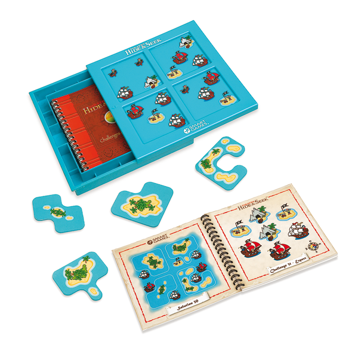

# Pirates: Hide and Seek solver
Solver for "Pirates: Hide and Seek" game by SmartGames:



Written by Dmitry Baranov as an "Hello, World!" exercise to learn Python.

It uses a bruteforce approach by calculating all possible masks transpositions and permuting them between 4 positions.

It gives all possible solutions for a given challenge.

# Requirements
- Python3

# Usage
```
python3 app.py
```
or, if you want to skip interactive challenge prompt:
```
echo 5,0,0,0,0 | python3 app.py
```

Challenge should be entered as a comma-separated list of 5 integers:

- Number of "white" pirate ships
- Number of "red" pirate ships
- Number of islands
- Number of caves
- Number of boats
